# Shopbop Knitwear Style Pattern Analysis
*Generated: 2025-01-02 17:52:33*

---

## Table of Contents
- [Top Style Combinations](#top-style-combinations)
- [Premium Style Patterns](#premium-style-patterns)
- [Trending Design Combinations](#trending-design-combinations)

---

# 1. Top Style Combinations

## **1. Striped Cardigans with Gold Buttons**

- **Description**: Cardigans featuring bold horizontal stripes paired with gold buttons, often in classic color combinations like red, navy, and cream. These designs evoke a nautical and timeless aesthetic.

- **Number of Occurrences**: 3

- **Price Range**: $50 - $100

- **Images**:

  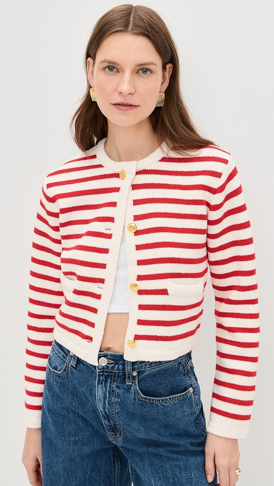

  *English Factory Knit Striped Sweater Cardigan*

  ---

  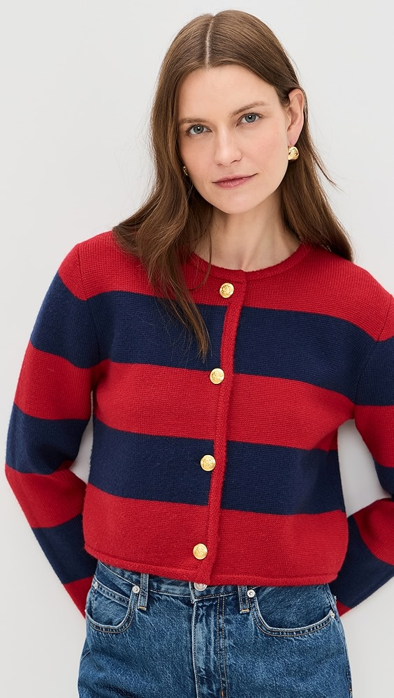

  *English Factory Striped Knit Cardigan*

  ---

  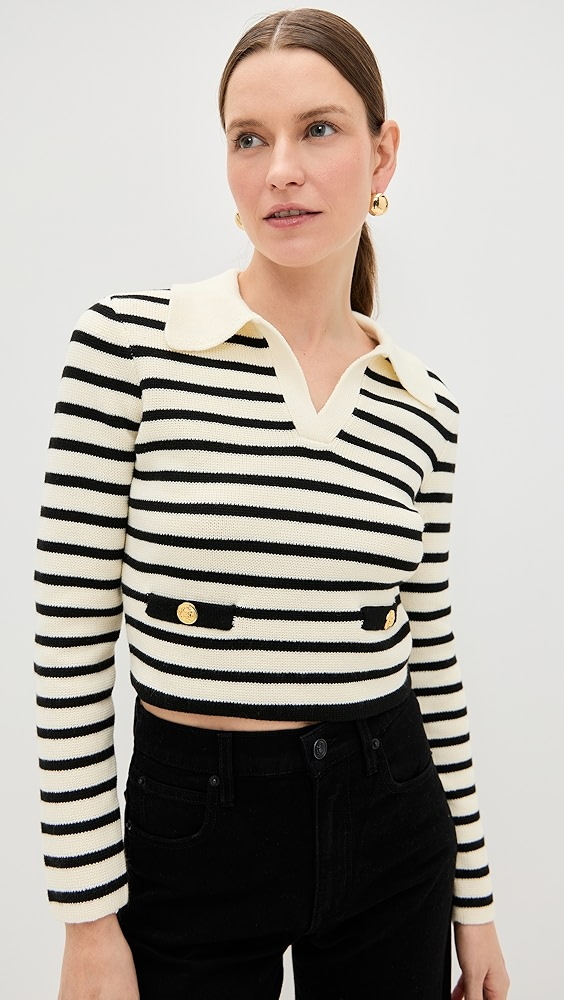

  *Endless Rose Striped Knit Collared Sweater*

- **Explanation**: The combination of bold horizontal stripes with gold button accents is a recurring theme, appearing in multiple products. The gold buttons add a touch of elegance and contrast to the casual stripe pattern, making it a popular style choice.

## **2. Fair Isle Patterned Cardigans**

- **Description**: Cardigans showcasing traditional Fair Isle or Nordic patterns, often with intricate designs around the yoke and cuffs. These sweaters combine classic knitting techniques with modern silhouettes.

- **Number of Occurrences**: 3

- **Price Range**: $150 - $250

- **Images**:

  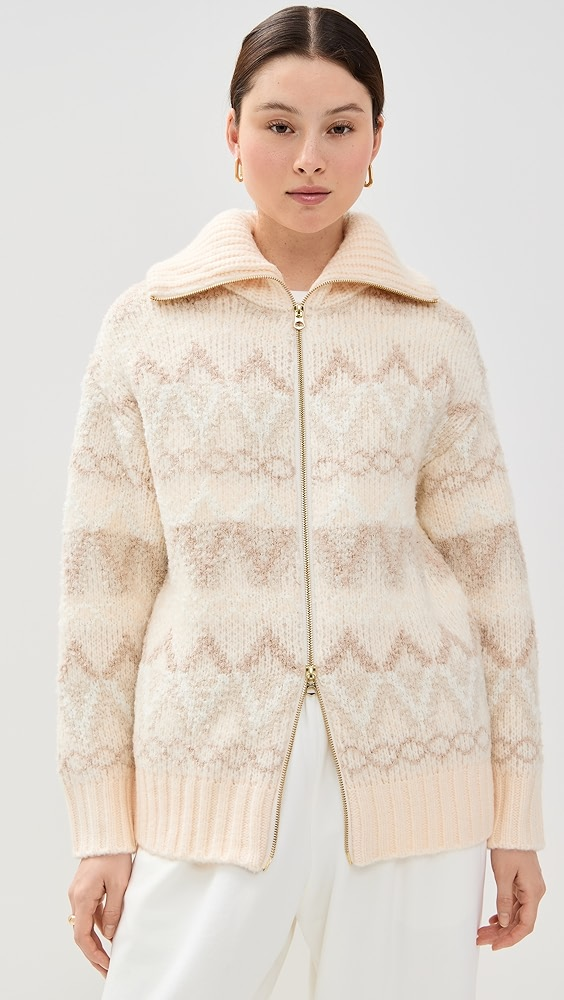

  *Varley Brooke Fair Isle Knit Jacket*

  ---

  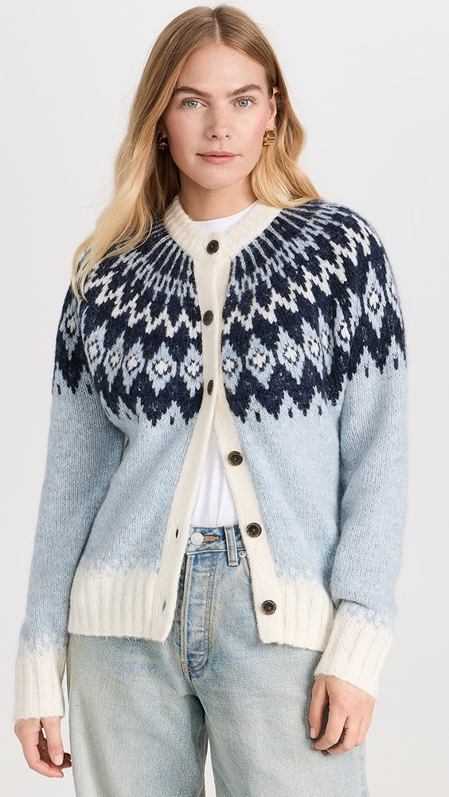

  *Alex Mill Ashwood Fair Isle Cardigan*

  ---

  

  *Alex Mill Hilde Fair Isle Cardigan*

- **Explanation**: The resurgence of Fair Isle patterns in cardigans reflects a trend towards embracing traditional craftsmanship. The repeated appearance of these designs indicates their popularity among consumers seeking timeless and cozy knitwear.

## **3. Vibrant Red Cardigans**

- **Description**: Cardigans in bold shades of red, featuring simple designs that allow the color to be the focal point. Some styles include ribbed textures or subtle detailing.

- **Number of Occurrences**: 3

- **Price Range**: $80 - $150

- **Images**:

  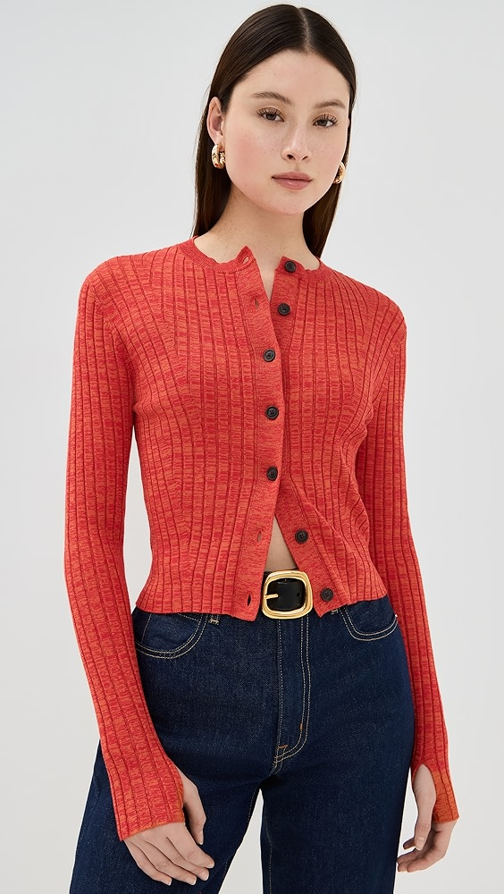

  *ALIGNE Michelle Cardigan*

  ---

  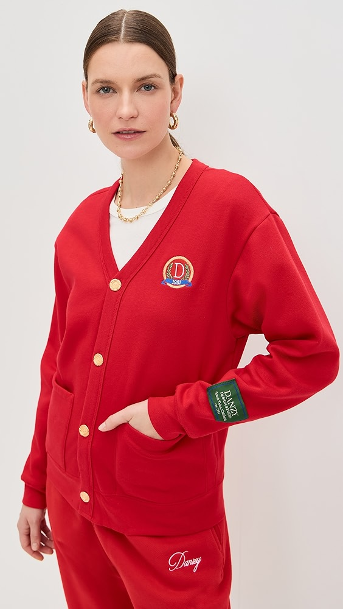

  *DANZY Full Length Cardigan*

  ---

  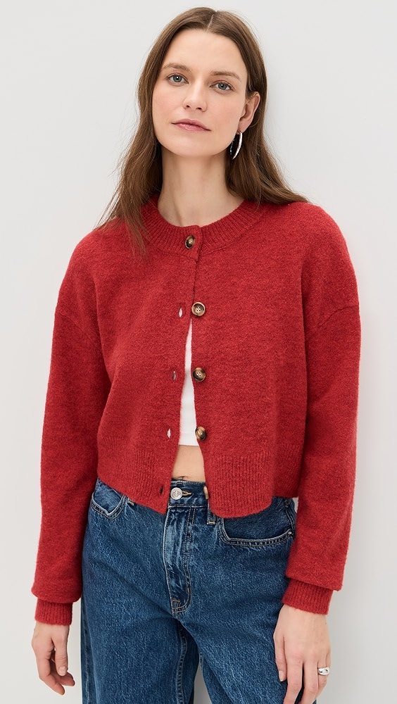

  *NIA Enzo Cardigan*

- **Explanation**: The use of vibrant red in cardigans is a standout trend, offering a bold statement piece. This recurring color choice suggests a consumer interest in eye-catching and confident wardrobe options.

# 2. Trending Design Combinations

## **1. Sweaters with Polo Collars**

- **Description**: Knit sweaters incorporating polo collars and button plackets. Styles often feature contrasting colors or trims, blending classic and modern elements.

- **Number of Occurrences**: 3

- **Price Range**: $90 - $200

- **Images**:

  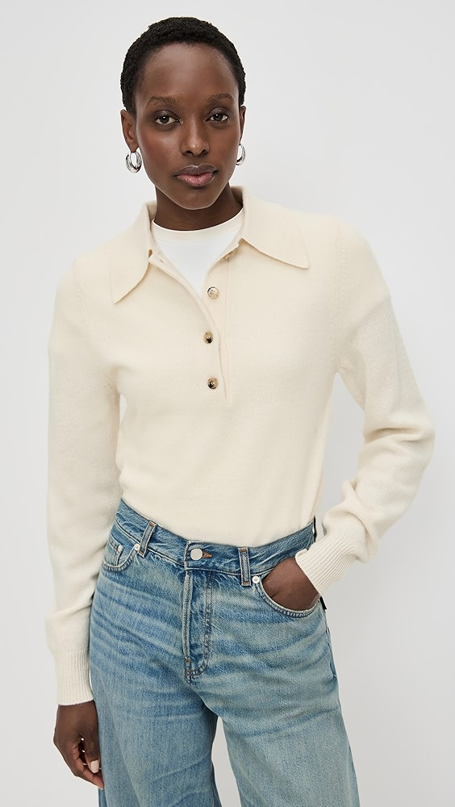

  *Sold Out NYC The Signature Polo Sweater*

  ---

  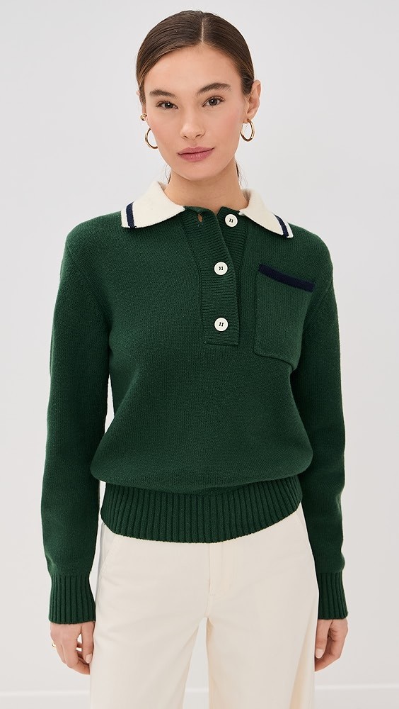

  *ALIGNE Brett Collared Sweater*

  ---

  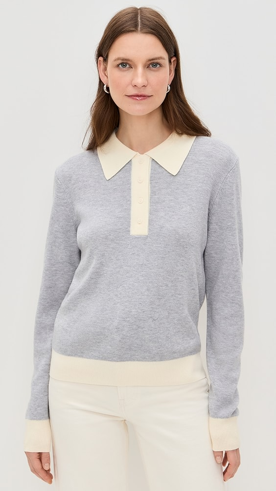

  *RE/DONE Color Block Polo*

- **Explanation**: The polo collar sweater is a trending design that merges casual comfort with a touch of formality. The repeated appearance of this style indicates growing consumer interest in versatile and stylish knitwear options.

## **2. Fuzzy Textured Striped Sweaters**

- **Description**: Sweaters combining bold horizontal stripes with fuzzy or mohair textures, offering a cozy and visually appealing aesthetic.

- **Number of Occurrences**: 3

- **Price Range**: $100 - $250

- **Images**:

  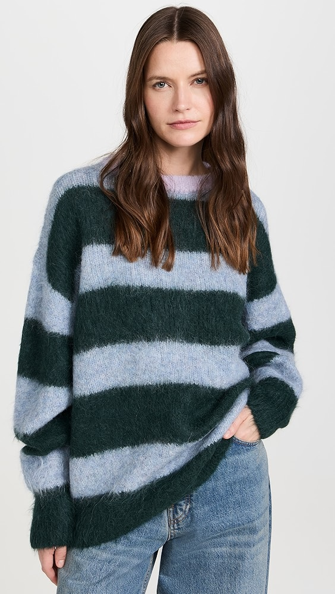

  *Free People Paris Sweater*

  ---

  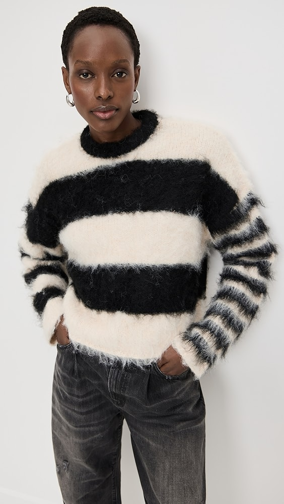

  *Ragged Priest Humbug Knit Sweater*

  ---

  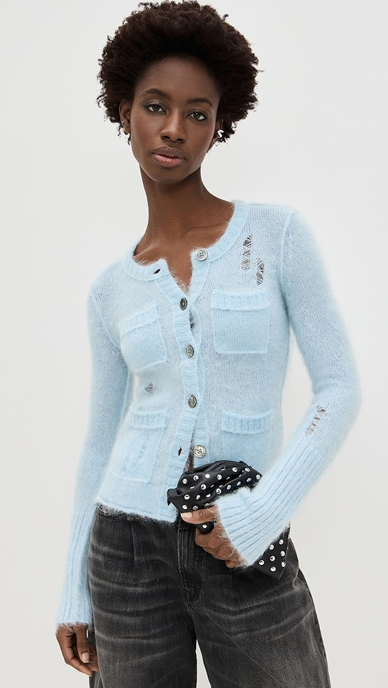

  *R13 Elongated Shrunken Crewneck Cardigan*

- **Explanation**: The combination of textured fabrics with classic stripe patterns creates a fresh and trendy look. The recurrence of this design suggests a consumer preference for comfort without sacrificing style.

---

*Last Updated: 2025-01-02*
